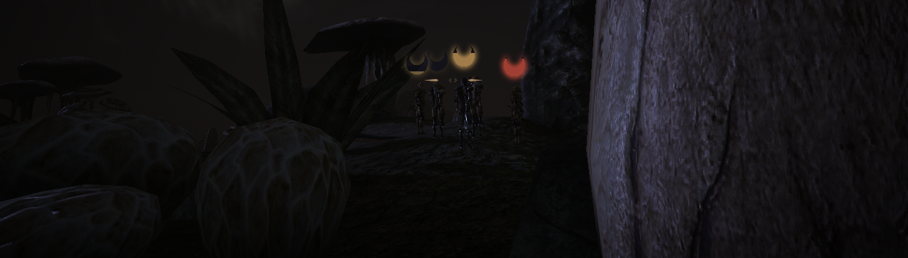

# ☯︎ Sneak! - Sneak is good now.

An OpenMW mod that makes sneak mechanics playable. Sneak detection is now a visually displayed gradual progress. It loosely follows original sneak detection formulas in a sense that whichever creature was difficult to sneak by in the original will also be difficult to sneak by now. There are many small tweaks to how those formulas work and how they translate into a gradual detection progress, aimed at providing a more fun gameplay experience. This mod attempts to strike a balance between gamified mechanics and """realism""".

Click on a preview below to watch a release trailer.
[](https://www.youtube.com/watch?v=e-O7qEIHpNw)

## ☯︎ Features

- Gradual visual detection progress instead of instant detection.

- Weapon skill is boosted by 50% while in sneak stance.

- Slight increase of sneak speed (it's 90% of the walk speed now). Due to how sneak animations and footstep sounds work it *might* feel like sneaking is faster than walking now - it is not, footstep sounds are just more frequent in sneaking stance.

- Contrary to vanilla boots don't affect your sneak chances. All in all your equipment has no effect on your sneak.

- Mod works by kicking you out of a sneaking stance when you are detected, so the engine can take over the NPC agression/attack logic, so dont be surprised when you are suddenly forced out of a sneaking stance - this is intended.

<p><a href="https://ko-fi.com/maxyari"></a><a href="https://ko-fi.com/maxyari"></a><br><a href="https://ko-fi.com/maxyari"></a></p>

## ☯︎ Recommendations

Try [Dynamic Reticle](https://www.nexusmods.com/morrowind/mods/56584) they go well together, as it adds some subtle sneak visual effects.

There are also few sneak-related mods out there such as [Burglary Overhaul](https://www.nexusmods.com/morrowind/mods/56965) and [SHOP](https://www.nexusmods.com/morrowind/mods/57747), both mod authors were very helpful and Sneak! will eventually seamlessly work with both of them (but probably it doesnt right now). I haven't personally tested them together myself, but wanted to put them on your radar!

## ☯︎ How to install

- **Requires OpenMW 0.50 or newer.**
- Install and enable [Max Yari's Script Services (MSS)](https://www.nexusmods.com/morrowind/mods/60256), it's a required dependency (most of my Lua mods require it now).
- Install this mod **with a mod organiser**: download the archive (or this repository as an archive) and drag and drop it into your mod organiser of choice (e.g [Mod Organizer 2](https://github.com/ModOrganizer2/modorganizer/releases) on Windows or [Nerevarine Organizer](https://github.com/grazelandsnomad/nerevarine_organizer/releases/tag/v0.70) on Linux). **Or** [read this tutorial](https://modding-openmw.com/tips/installing-mods/) on how to install mods using the launcher or completely manually (it's also very easy).
- Enable **both** `SneakIsGoodNow.omwscripts` and `SneakIsGoodNow.omwaddon` in the "Content Files" tab of the OpenMW launcher.
- In game, **enable `Toggle Sneak`** in Options -> Scripts -> OpenMW Controls. It makes it so that you don't have to hold the sneak button to sneak, this mod will not work properly without it.

Have fun!

## ☯︎ For Developers

**Sneak!** provides a minimalist interface exposing current player detection state. You can read about how to use script interfaces [here](https://openmw-zack.readthedocs.io/en/lua_global_new/reference/lua-scripting/overview.html#script-interfaces).

Note that Sneak! mostly only works while player is sneaking, it does not do any detection or line-of-sight checks when player is not sneaking.

Interface is available only on player scripts, it exposes a player detection state:

```Lua
local ps = I.SneakIsGoodNow.playerState
-- Available properties:
ps.isSneaking -- boolean
ps.detectedByNonAggro -- boolean
ps.isMoving -- boolean
ps.isInvisible -- boolean
ps.chameleon -- 1 - 100 number - strength of chameleon effect on a player

```

Since the mod works by kicking you out of sneak state when you are detected - you can consider player detected when `ps.isSneaking` is false. Unless you are detected only by non-aggressive creatures (player is not booted out of sneak then), then `isSneaking` will still be true while `detectedByNonAggro` will be true.

Furthermore there is a table with few properties that you can modify to affect how detectable player is:

```Lua
local extraMods = I.SneakIsGoodNow.playerState.extraMods
extraMods.elusivenessMod = 1.0 -- default value
extraMods.elusivenessConst = 0 -- default value
```

`elusivenessMod` is more or less a general modifier of how elusive player is, it's applied before chameleon; adds a flat bonus to overall elusiveness.

`elusivenessConst` is a flat bonus that will be added to player's elusiveness score.

If multiple mods will be altering these values - obviously last one will win, since I don't have a system in place for multiple mods to introduce their own separate modifiers, but it's a fairly niche use case so I'm sure it will be fiiiiiine.

I also haven't tested this API at all, but I'm sure it will be fiiiiiine ;)

## ☯︎ Appreciation

Thanks to [Blurpandra](https://www.nexusmods.com/profile/blurpandra/mods?gameId=100) for sharing a sneak detection code from Burglary Overhaul mod. To [fallchildren](https://gitlab.com/fallchildren) and [choirbug](https://gitlab.com/olyukha) for inspiring me to try this janky aproach to a sneak overhaul - they are currently working on a "Dark Project" mod (you can find it in OpenMW discor in mods section) which is a more ambitious stealth overhaul inspired by Thief series mechanics. 

Check their mods, especially the [footstep sound mod](https://gitlab.com/fallchildren/openmw-footsteps), choirbug made a whole bunch of very immersive amazing sounds for it (to hear them you will need to change the sound backend in the mod's settings).

And also to the entirety of the OpenMW community, my inspiration almost always comes from interacting with OpenMW discord, sometimes we have some differences admittedly, but hey, who doesn't? Love you all :3

## ☯︎ AI use discalimer

To be honest, nowadays everyone seem to be using LLMs to some capacity, so leaving disclaimers like that becomes pointless, but sometimes I still do since I know some people are bothered by the whole AI thing (not without a reason) and will appreciate a disclaimer.

So I mostly used Qwen to help with some coding tasks and with spelling and grammar in this readme, as well as ChatGPT for a research into creature aggression OpenMW source code and porting that to Lua.